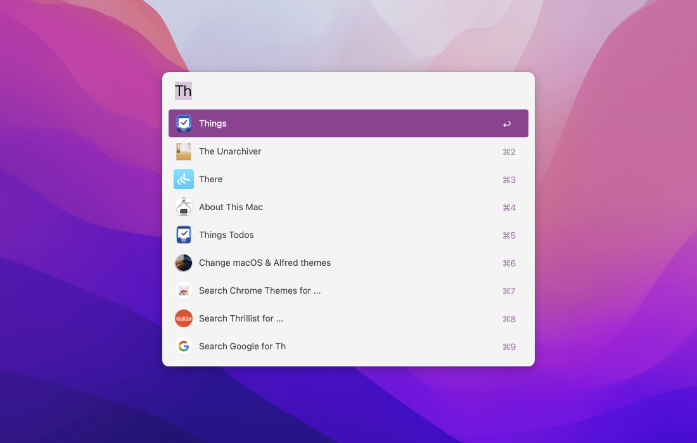

# Monterey Powerpack Theme
Alfred Themes for Monterey

Here is a collection of [Alfred Powerpack Themes](https://www.alfredapp.com/help/appearance/) that are inspired by Apple's macOS Monterey appearance and accent color schemes.

[**Download Themes**](https://github.com/chrismessina/alfred-theme-monterey/releases/latest)

## Installation

This theme uses [SF Pro](https://developer.apple.com/design/human-interface-guidelines/ios/visual-design/typography/), which is [available for download](https://developer.apple.com/fonts/) from Apple. Download and install that first.

Then download and unzip the file above, and double-click each `.alfredappearance` file to install them.

## Previews

### Blue

### Graphite

### Green

### Orange

### Pink

### Purple

### Red

### Yellow

## Suggested configuration

- Disable the Alfred hat logo by checking: `Alfred Preferences › Appearance › Options › Hide hat on Alfred window`
- Disable result shortcuts by unchecking: `Alfred Preferences › Appearance › Options › Hide result shortcuts`

Simplify results by switching the result subtext to "Only for Alternative Actions".

## Inspiration

The inspiration for this theme came from [a request](https://www.alfredforum.com/topic/17071-can-we-have-some-coloured-themes-for-the-m1-imac-please/) in the Alfred Forum from [hootle](https://www.alfredforum.com/profile/23171-hootle/0).

## About

This theme is unaffiliated with nor endorsed by Apple, Inc. All trademarks are the property of their respective owners.
